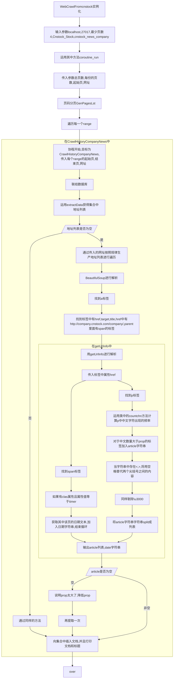
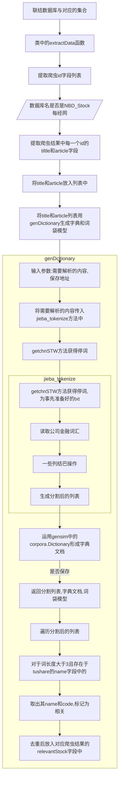
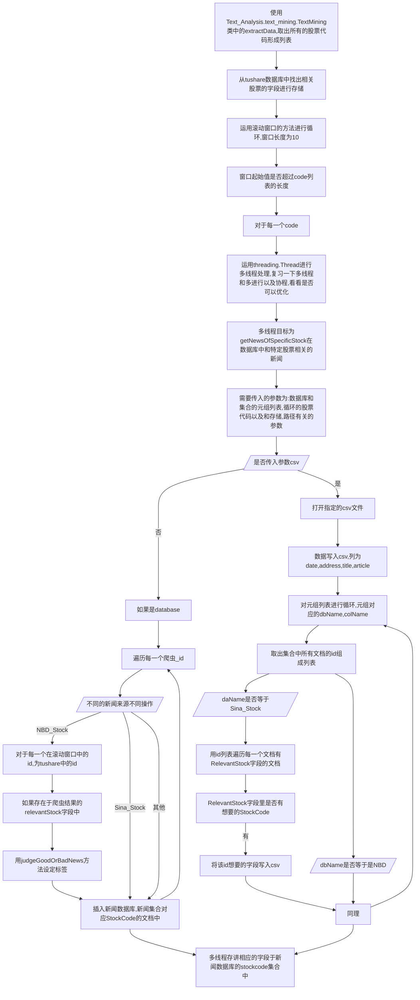
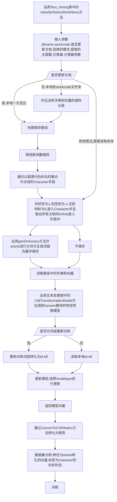
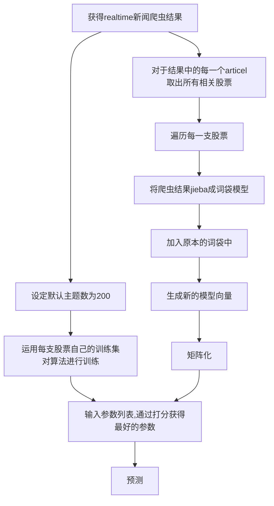

# 上市公司新闻文本分析与分类预测

 

-------------------------------

## 简介

上市公司新闻文本分析与分类预测的基本步骤如下：

 - 将原来的改为仅从金融界爬取
 - 从Tushare上获取沪深股票日线数据（开、高、低、收、成交量和持仓量）和基本信息（包括股票代码、股票名称、所属行业、所属地区、PE值、
   总资产、流动资产、固定资产、留存资产等）
 - 对抓取的新闻文本按照，去停用词、加载新词、分词的顺序进行处理
 - 利用前两步中所获取的股票名称和分词后的结果，抽取出每条新闻里1所包含的（0支、支或多支）股票名称，并将所对应的所有股票代码，组合成与该条新闻相关
   的股票代码列表，并在历史数据表中增加一列相关股票代码数据
 - 从历史新闻数据库中抽取与某支股票相关的所有新闻文本，利用该支股票的日线数据（比如某一天发布的消息，
   在设定N天后如果价格上涨则认为是利好消息，反之则是利空消息）给每条新闻贴上“利好”和“利空”的标签，并存储到新的数据库中（或导出到CSV文件）
 - 实时抓取新闻数据，判断与该新闻相关的股票有哪些，利用上一步的结果，对与某支股票相关的所有历史新闻文本（已贴标签）进行文本分析（构建新的特征集），
   然后利用SVM（或随机森林）分类器对文本分析结果进行训练（如果已保存训练模型，可选择重新训练或直接加载模型），最后利用训练模型对实时抓取的新闻数据进行分类预测

开发环境`Python-v3(3.6)`：

 - gensim==3.2.0
 - jieba==0.39
 - scikit-learn==0.19.1
 - pandas==0.20.0
 - numpy==1.13.3+mkl
 - scipy==0.19.0
 - pymongo==3.6.0 #我可以用pymysql来替代
 - beautifulsoup4==4.6.0
 - tushare==1.1.1
 - requests==2.18.4
 - gevent==1.2.1

## 文本处理 -> [text_processing.py](https://github.com/DemonDamon/Listed-company-news-crawl-and-text-analysis/blob/master/Text_Analysis/text_processing.py)

 - 文本处理包括去停用词处理、加载新词、中文分词、去掉出现次数少的分词
 - 生成字典和Bow向量，并基于Gensim转化模型（LSI、LDA、TF-IDF）转化Bow向量
 - 计算文本相似度
 - 打印词云

## 文本挖掘 -> [text_mining.py](https://github.com/DemonDamon/Listed-company-news-crawl-and-text-analysis/blob/master/Text_Analysis/text_mining.py)

 - 从新闻文本中抽取特定信息，并贴上新的文本标签方便往后训练模型
 - 从数据库中抽取与某支股票相关的所有新闻文本
 - 将贴好标签的历史新闻进行分类训练，利用训练好的模型对实时抓取的新闻文本进行分类预测

## 新闻爬取 -> [crawler_cnstock.py](https://github.com/DemonDamon/Listed-company-news-crawl-and-text-analysis/blob/master/Crawler/crawler_cnstock.py), [crawler_jrj.py](https://github.com/DemonDamon/Listed-company-news-crawl-and-text-analysis/blob/master/Crawler/crawler_jrj.py), [crawler_nbd.py](https://github.com/DemonDamon/Listed-company-news-crawl-and-text-analysis/blob/master/Crawler/crawler_nbd.py), [crawler_sina.py](https://github.com/DemonDamon/Listed-company-news-crawl-and-text-analysis/blob/master/Crawler/crawler_sina.py), [crawler_stcn.py](https://github.com/DemonDamon/Listed-company-news-crawl-and-text-analysis/blob/master/Crawler/crawler_stcn.py)

 - 分析网站结构，多线程（或协程）爬取上市公司历史新闻数据

## Tushare数据提取 -> [crawler_tushare.py](https://github.com/DemonDamon/Listed-company-news-crawl-and-text-analysis/blob/master/run_crawler_tushare.py)

 - 获取沪深所有股票的基本信息，包括股票代码、股票名称、所属行业、所属地区等

## 用法

 - 配好运行环境以及安装MongoDB，最好再安装一个MongoDB的可视化管理工具Studio 3T
 - 先运行[crawler_cnstock.py](https://github.com/DemonDamon/Listed-company-news-crawl-and-text-analysis/blob/master/Crawler/crawler_cnstock.py), [crawler_jrj.py](https://github.com/DemonDamon/Listed-company-news-crawl-and-text-analysis/blob/master/Crawler/crawler_jrj.py), [crawler_nbd.py](https://github.com/DemonDamon/Listed-company-news-crawl-and-text-analysis/blob/master/Crawler/crawler_nbd.py), [crawler_sina.py](https://github.com/DemonDamon/Listed-company-news-crawl-and-text-analysis/blob/master/Crawler/crawler_sina.py), [crawler_stcn.py](https://github.com/DemonDamon/Listed-company-news-crawl-and-text-analysis/blob/master/Crawler/crawler_stcn.py)这5个py文件，而且可能因为对方服务器没有响应而重复多次运行这几个文件才能抓取大量的历史数据
 - 接着运行[crawler_tushare.py](https://github.com/DemonDamon/Listed-company-news-crawl-and-text-analysis/blob/master/run_crawler_tushare.py)从Tushare获取基本信息和股票价格
 - 最后运行[run_main.py](https://github.com/DemonDamon/Listed-company-news-crawl-and-text-analysis/blob/master/run_main.py)文件，其中有4个步骤，除了第1步初始化外，其他几步最好单独运行
 - 注意：所有程序都必须在文件所在目录下运行

## 更新目标

 - 可以将新的新闻来源改为tushare中的新闻来源,获取更加方便.


## 个人小理解


## step 0 完成爬虫

数据结构

还有一个tushare爬虫数据库 数据库名为Stock 有Basic_Info的集合与代码为的集合

新闻爬虫数据库 : 以新闻来源为数据库,以sina_news_company为集合,以_id为主键,其中有个字段为'RelevantStock',表示相关的股票,内容可以解析出股票代码

新闻数据库: 最终用于预测的数据库 数据库名为Stock_News 集合名为股票code,以_id为主键,每个id下面内容有时间,地址,标题,文章内容,标签



爬虫其实都是大同小异,不同的地方有

* 页码顺序不同,有些需要以数字作为顺序,有些需要以时间作为顺序
* 标签内容不同,需要具体问题具体分析


对tushare进行操作 提取现在的股票基本信息放入"Stock","Basic_Info" 提取价格信息放入"Stock",'stockCode'

```mermaid
graph TB
	实例化Crawler_tushare中的CrawlStockData类-->
	传入IP,端口参数-->
	使用类下的getStockBasicFromTushare方法-->
	传入参数dbName=Stock,colname=Basic_Info-->
	提取出基本信息放入指定的集合中-->
	运用extractData将code这个字段提出出来形成一个列表-->
	对于每一个code-->
	联结dbName=Stock,对应的每一个code集合-->
	传入以stockcode为顺序的txt地址,打开txt&#40这个txt应该是自己事先下好的&#41-->
	读取txt的每行,存入列表中-->
	提取信息插入code集合
```


## step 1 联结数据库

将Text_Analysis.text_mining.py中的 TextMining类实例化,,输入数据库的端口和IP 

```python
text_mining_obj = tm.TextMining(IP="localhost",PORT=27017)
```

## step 2 从所有的网页爬虫数据库的新闻中提取相关的股票代码

### 如何定义相关

被jieba处理过的长度长度大于3的并且存在于数据库的定义为相关

为何是这个定义,可能需要亲自爬虫才能明白.

------

前提是先用爬虫将数据爬到数据库中后才能进行操作

用到了TextMining实例化后,其中的方法extractStockCodeFromArticle

```python
text_mining_obj.extractStockCodeFromArticle("NBD_Stock","nbd_news_company") # 从每经网的新闻中抽出相关的股票代码
	text_mining_obj.extractStockCodeFromArticle("Cnstock_Stock","cnstock_news_company") # 从中国证券网的新闻中抽出相关的股票代码
	text_mining_obj.extractStockCodeFromArticle("Stcn_Stock","stcn_news_company") # 从证券时报网的新闻中抽出相关的股票代码
	text_mining_obj.extractStockCodeFromArticle("Jrj_Stock","jrj_news_company") # 从金融界网的新闻中抽出相关的股票代码
```

对于extractStockCodeFromArticle ,这个是为了提取被新闻或者报告提到的股票代码,需要输入两个参数,数据库的名字和集合的名字



------

## step 3 从爬虫数据库提取所有的和股票相关的新闻放入新闻数据库中



## step 4 爬取网页列表中的现在的新闻并分类

```python
web_list = ['sina','jrj','cnstock','stcn']
	with futures.ThreadPoolExecutor(max_workers=4) as executor:
		future_to_url = {executor.submit(crawlers,param) : ind for ind, param in enumerate(web_list)} #字典格式上传到线程池中
        
```

## step 5 文本挖掘



## step 6 对realtime爬虫结果进行预测




## 总结

```mermaid
graph TB
	爬虫-->tushare-->获得股票代码与name-->dbname=Stock,collection=股票代码--名字和代码来自-->将新闻中提到的相关股票代码和股票名称增加到一个新的字段relevantstock中
	爬虫-->新闻网站-->获得股票新闻-->dbname=新闻网站,collection=新闻网站_news_company-->将新闻中提到的相关股票代码和股票名称增加到一个新的字段relevantstock中-->将每个股票代码有关的新闻内容标记好坏后放入新闻数据库中,dbname=Stock_new,collection=股票代码-->执行文本挖掘-->对新闻数据库中的数据进行处理,将其向量化-->即每只股票有自己的新闻训练集与训练模型-->爬取新的信息将其向量化-->预测
	
```


